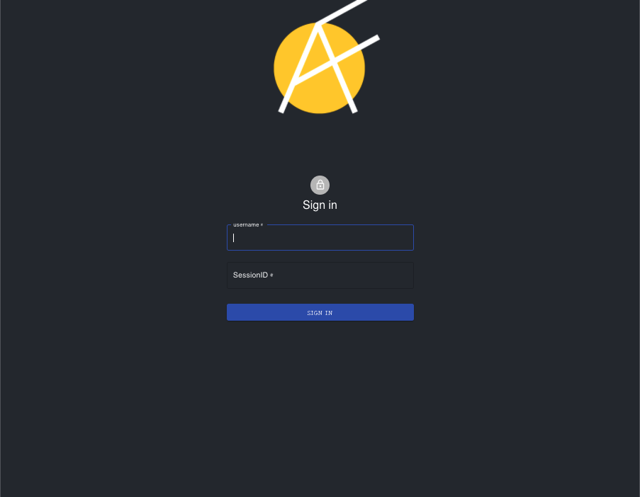

# Anonyflix - Collaborative Movie Decision-Making App

With so many film and television choices spread across dozens of streaming services, deciding on what to watch can be time-consuming and stressful. Anonyflix was designed to be a fun, collaborative interface where users can see a massive spread of available movies, select them anonymously, and decide together based on the collected options.

Important Note: This application is currently in development. This project uses the TMDb API but is not endorsed or certified by TMDb.

## Table of Contents

- [Technologies Used](#technologies-used)
- [Features](#features)

## Technologies Used

> Front End

- [React](https://reactjs.org/)
- [Material UI](https://material-ui.com/)
- [React-Spring](https://www.react-spring.io/)

> Back End

- [Websocket](https://www.npmjs.com/package/websocket)

> API

- [The Movie Database](https://www.themoviedb.org/)

## Features

### Join a session

On entering the site users are prompted to create a username and join a session by entering a session id. Session ids will correspond to a unique session where all users can share their choices and see all available choices.

## Filtering Options

Users are presented with a list of movie cards organized by filters like popular, top rated and now playing.

## Additional Movie Information

By clicking the movie card, users can flip the card to view the details of that movie.

## Making Selections

Users can click the add / remove button to add or remove a movie of their choice to and from the collective choices.

## Multiple Users

New users who join the session are presented with the same selection options and can immediately see the most current list of selected options. Additional users can add and remove movies. Removing movies will only remove the movie they selected, rather than any movie with that title.
